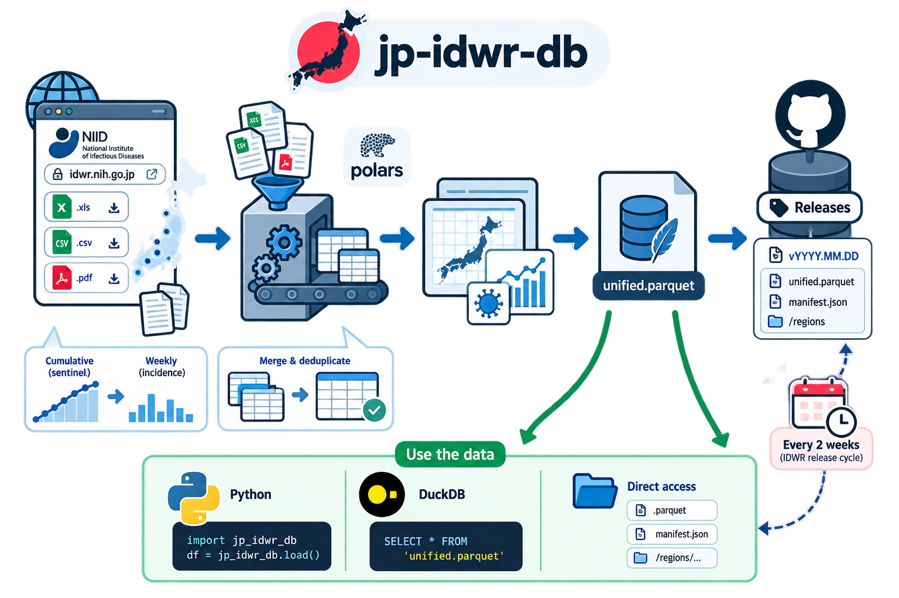

# jp-idwr-db

[](https://pypi.org/project/jp-idwr-db/)
[](https://pypi.org/project/jp-idwr-db/)
[](https://github.com/AlFontal/jp-idwr-db/actions/workflows/ci.yml)
[](https://github.com/AlFontal/jp-idwr-db/blob/main/LICENSE)

`jp-idwr-db` makes Japan's IDWR infectious disease surveillance data easier to use.

It collects the official NIID/JIHS files, cleans and combines data published across different formats and archives, and releases analysis-ready weekly data as Parquet. You can use it through the Python package or read the release files directly with DuckDB, R, Arrow, Spark, or any other tool that supports Parquet.

<p align="center">
  
</p>

IDWR reports are published weekly. `jp-idwr-db` checks for new data and publishes an updated, versioned snapshot every two weeks via GitHub Actions and releases.

## Install

```bash
pip install jp-idwr-db
```

## Quick start

Load the combined dataset:

```python
import jp_idwr_db as jp

df = (
    jp.load("unified", version="latest")
    .select(["date", "prefecture", "category", "disease", "count", "source"])
)

print(df)
```

```text
shape: (5_493_071, 6)
┌────────────┬────────────┬──────────┬─────────────────────────────┬───────┬────────────────────┐
│ date       ┆ prefecture ┆ category ┆ disease                     ┆ count ┆ source             │
│ ---        ┆ ---        ┆ ---      ┆ ---                         ┆ ---   ┆ ---                │
│ date       ┆ str        ┆ str      ┆ str                         ┆ f64   ┆ str                │
╞════════════╪════════════╪══════════╪═════════════════════════════╪═══════╪════════════════════╡
│ 1999-04-05 ┆ Aichi      ┆ total    ┆ AIDS                        ┆ 0.0   ┆ Confirmed cases    │
│ 1999-04-05 ┆ Aichi      ┆ total    ┆ Acute poliomyelitis         ┆ 0.0   ┆ Confirmed cases    │
│ 1999-04-05 ┆ Aichi      ┆ total    ┆ Acute viral hepatitis       ┆ 4.0   ┆ Confirmed cases    │
│ 1999-04-05 ┆ Aichi      ┆ total    ┆ Amebiasis                   ┆ 0.0   ┆ Confirmed cases    │
│ 1999-04-05 ┆ Aichi      ┆ total    ┆ Anthrax                     ┆ 0.0   ┆ Confirmed cases    │
│ …          ┆ …          ┆ …        ┆ …                           ┆ …     ┆ …                  │
│ 2026-08-03 ┆ Yamanashi  ┆ total    ┆ West Nile fever             ┆ 0.0   ┆ All-case reporting │
│ 2026-08-03 ┆ Yamanashi  ┆ total    ┆ Western equine encephalitis ┆ 0.0   ┆ All-case reporting │
│ 2026-08-03 ┆ Yamanashi  ┆ total    ┆ Yellow fever                ┆ 0.0   ┆ All-case reporting │
│ 2026-08-03 ┆ Yamanashi  ┆ total    ┆ Zika virus infection        ┆ 0.0   ┆ All-case reporting │
└────────────┴────────────┴──────────┴─────────────────────────────┴───────┴────────────────────┘
```

For most analyses, `unified` is the dataset you want.

You can also filter while loading:

```python
tb = (
    jp.get_data(
        disease="Tuberculosis",
        year=2024,
        prefecture=["Tokyo", "Osaka", "Hokkaido"],
        version="latest",
    )
    .select(["date", "prefecture", "disease", "count", "source"])
)

print(tb)
```

```text
shape: (156, 5)
┌────────────┬────────────┬──────────────┬───────┬────────────────────┐
│ date       ┆ prefecture ┆ disease      ┆ count ┆ source             │
│ ---        ┆ ---        ┆ ---          ┆ ---   ┆ ---                │
│ date       ┆ str        ┆ str          ┆ str   ┆ f64                │
╞════════════╪════════════╪══════════════╪═══════╪════════════════════╡
│ 2024-01-01 ┆ Hokkaido   ┆ Tuberculosis ┆ 2.0   ┆ All-case reporting │
│ 2024-01-01 ┆ Osaka      ┆ Tuberculosis ┆ 3.0   ┆ All-case reporting │
│ 2024-01-01 ┆ Tokyo      ┆ Tuberculosis ┆ 15.0  ┆ All-case reporting │
│ 2024-01-08 ┆ Hokkaido   ┆ Tuberculosis ┆ 4.0   ┆ All-case reporting │
│ 2024-01-08 ┆ Osaka      ┆ Tuberculosis ┆ 17.0  ┆ All-case reporting │
│ …          ┆ …          ┆ …            ┆ …     ┆ …                  │
│ 2024-12-23 ┆ Hokkaido   ┆ Tuberculosis ┆ 5.0   ┆ All-case reporting │
│ 2024-12-23 ┆ Osaka      ┆ Tuberculosis ┆ 16.0  ┆ All-case reporting │
│ 2024-12-23 ┆ Tokyo      ┆ Tuberculosis ┆ 53.0  ┆ All-case reporting │
└────────────┴────────────┴──────────────┴───────┴────────────────────┘
```

Release data are downloaded on first use and cached locally. Use `version="latest"` when you want the newest published snapshot.

## Datasets

| Dataset    | Contents                                                                        |
| ---------- | ------------------------------------------------------------------------------- |
| `unified`  | Combined, deduplicated weekly surveillance data. Recommended for most analyses. |
| `bullet`   | Modern weekly all-case reporting (`zensu`)                                      |
| `sentinel` | Modern weekly sentinel surveillance (`teitenrui`)                               |
| `sex`      | Historical sex-disaggregated surveillance                                       |
| `place`    | Historical place-category surveillance                                          |

The unified dataset combines historical confirmed-case data with modern all-case and sentinel reporting while avoiding overlapping records.

One important transformation is applied to the sentinel data: the source `teitenrui` files report year-to-date cumulative counts, so `jp-idwr-db` converts them to weekly incidence within each year, prefecture, and disease.

```text
weekly_count = cumulative_count[t] - cumulative_count[t - 1]
```

The `date` column represents the Monday at the start of the corresponding ISO surveillance week.

See [DATASETS.md](./docs/DATASETS.md) for detailed schema and coverage, and [DISEASES.md](./docs/DISEASES.md) for disease-by-disease temporal coverage.

## Use the data without Python

The data releases are regular Parquet files, so the Python package is optional.

Each GitHub release contains:

* `unified.parquet` and the other dataset tables
* `manifest.json` with file metadata, schemas, sizes, and checksums
* an optional `jp_idwr_db.duckdb` database with views over the Parquet files

For example, with DuckDB:

```sql
SELECT date, prefecture, disease, count
FROM read_parquet('unified.parquet')
WHERE disease = 'Tuberculosis'
  AND year = 2024
ORDER BY date, prefecture;
```

Or query the packaged DuckDB database directly:

```bash
duckdb jp_idwr_db.duckdb
```

The same Parquet files can be read from R, Arrow, Spark, Polars, pandas, or any other compatible tool.

## Data source and updates

The package builds on official infectious disease surveillance data published by the National Institute of Infectious Diseases (NIID) and the Japan Institute for Health Security (JIHS).

The source archive has changed over time:

* historical annual surveillance tables are published as `.xls` / `.xlsx`
* modern all-case reports (`zensu`) are published weekly as `.csv`
* modern sentinel reports (`teitenrui`) are published weekly as `.csv`

Source: [JIHS IDWR Surveillance Data Tables](https://id-info.jihs.go.jp/en/surveillance/idwr/rapid/)

The underlying IDWR surveillance data are weekly. `jp-idwr-db` refreshes its published release approximately every two weeks, incorporating newly available reports into a new versioned snapshot.

Source files are parsed, cleaned, normalized, and combined by this project. Sentinel cumulative counts are converted to weekly incidence as described above.

`jp-idwr-db` is an independent project and is not an official NIID or JIHS publication. 

It is inspired by the R package by Tomonori Hoshi, [`jpinfect`](https://github.com/TomonoriHoshi/jpinfect) and adapted for Python and more generalized usage.


See the official [JIHS terms of use](https://id-info.jihs.go.jp/en/term_of_use.pdf).

## More documentation

* [Dataset schemas and coverage](./docs/DATASETS.md)
* [Disease coverage](./docs/DISEASES.md)
* [Data wrangling examples](./docs/EXAMPLES.md)
* [Contributing](./CONTRIBUTING.md)
* [Changelog](./CHANGELOG.md)

## License

GPL-3.0-or-later. See [LICENSE](./LICENSE).